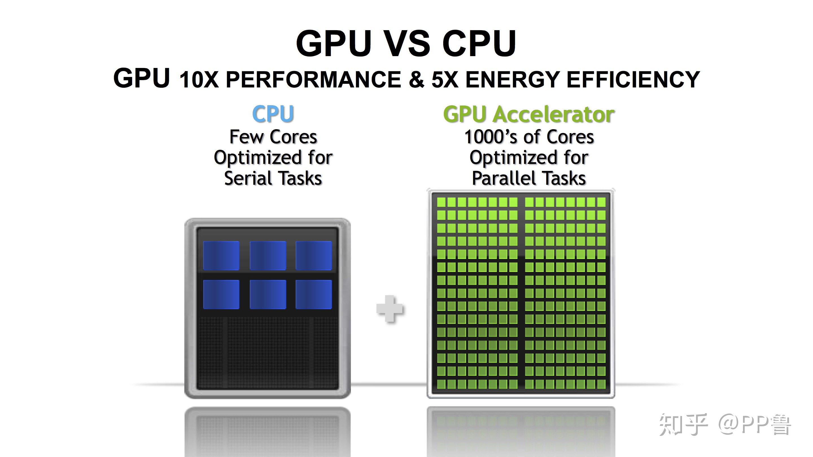
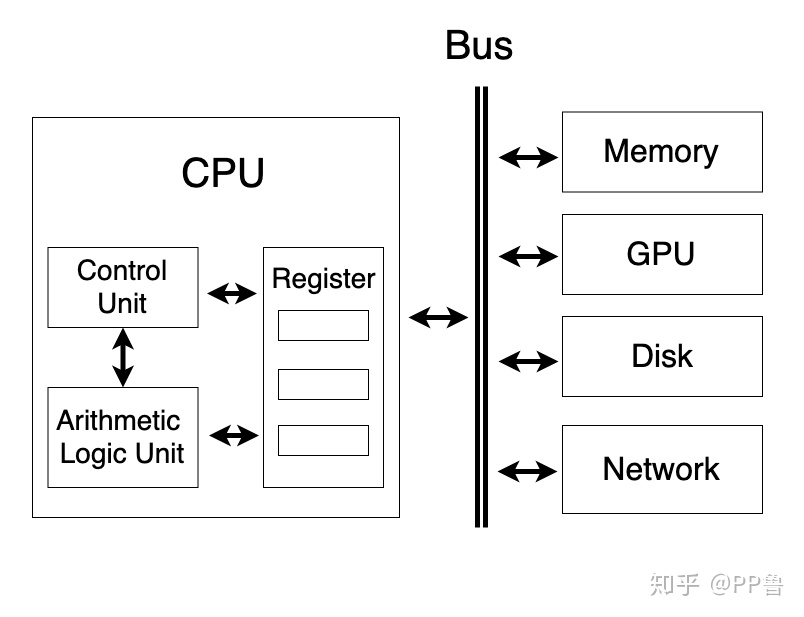
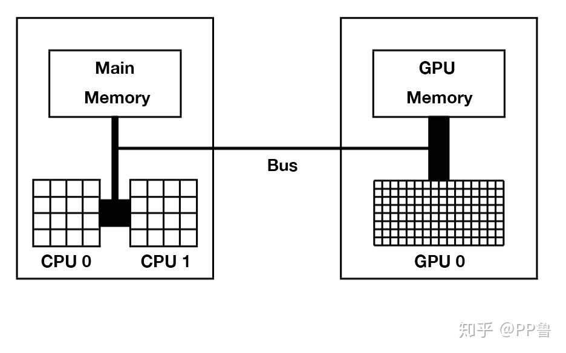
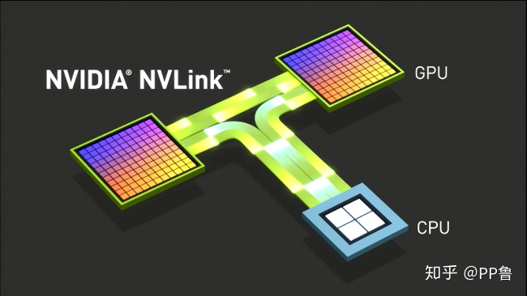
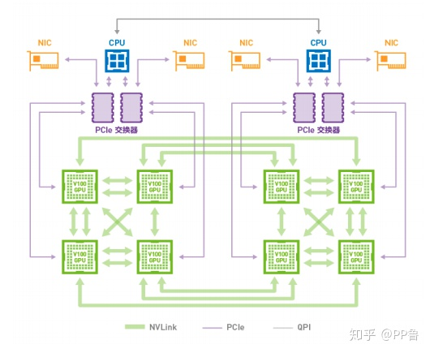

# Cuda programming 


## 1. GPU 计算加速

### Introduction
金融建模、自动驾驶、智能机器人、新材料发现、脑神经科学、医学影像分析...人工智能时代的科学研究极度依赖计算力的支持。
提供算力的各家硬件芯片厂商中，最抢镜的当属英伟达Nvidia了。
这家做显卡起家的芯片公司在深度学习兴起后可谓红得发紫，如果不聊几句GPU和英伟达，都不好意思跟别人说自己是做人工智能的。
那么，英伟达的GPU是如何加速计算呢？本系列将介绍GPU计算加速的一些基础知识：

1. GPU硬件知识和基础概念：包括CPU与GPU的区别、GPU架构、CUDA软件栈简介。
2. GPU编程入门：主要介绍CUDA核函数，Thread、Block和Grid概念，并使用Python Numba进行简单的并行计算。
3. GPU编程进阶：主要介绍多核配置和存储管理。
4. GPU编程实践：使用Python Numba解决复杂问题

### 1.1 What is GPU?
GPU全名为Graphics Processing Unit，又称视觉处理器、图形显示卡。
GPU负责渲染出2D、3D、VR效果，主要专注于计算机图形图像领域。
后来人们发现，GPU非常适合并行计算，可以加速现代科学计算，GPU也因此不再局限于游戏和视频领域。

### 1.2 CPU and GPU
现代CPU处理数据的速度在**纳秒**级别，为何还要使用GPU来加速？CPU能被GPU替代吗？

#### 1.2.1 为什么要用GPU加速？

无论是CPU还是GPU，在进行计算时，都需要用核心（Core）来做算术逻辑运算，比如加减乘与或非等。
核心中有ALU（逻辑运算单元）和寄存器等电路。
在进行计算时，一个核心只能顺序执行某项任务。
不可能“吃着火锅唱着歌”，因为吃饭唱歌都占着嘴呢。
所以为了同时并行地处理更多任务，芯片公司开发出了多核架构，只要相互之间没有依赖，每个核心做自己的事情，多核之间互不干扰，就可以达到并行计算的效果，极大缩短计算时间。




个人桌面电脑CPU只有2到8个CPU核心，数据中心的服务器上也只有20到40个左右CPU核心，GPU却有上千个核心。
与CPU的核心不同，GPU的核心只能专注于某些特定的任务


#### 1.2.2 计算机框架



如果只关注CPU和GPU，那么计算结构将如下图所示。
CPU主要从主存（Main Memory）中读写数据，并通过总线（Bus）与GPU交互。
GPU除了有超多计算核心外，也有自己独立的存储，被称之为显存。
一台服务器上可以安装多块GPU卡，但GPU卡的发热量极大，普通的空调系统难以给大量GPU卡降温，所以大型数据中心通常使用水冷散热，并且选址在温度较低的地方。




#### 1.2.3 计算机框架
GPU核心在做计算时，只能直接从显存中读写数据，程序员需要在代码中指明哪些数据需要从内存和显存之间相互拷贝。
这些数据传输都是在总线上，因此<font color="#dd0000"> 总线的传输速度和带宽成了部分计算任务的'瓶颈'</font><br />。
也因为这个瓶颈，很多计算任务并不适合放在GPU上，比如笔者这两年关注的推荐系统虽然也在使用深度学习，但因为输入是大规模稀疏特征，GPU加速获得的收益小于数据互相拷贝的时间损失。
当前最新的总线技术是NVLink，IBM的Power CPU和英伟达的高端显卡可以通过NVLink直接通信。同时，单台机器上的多张英伟达显卡也可以使用NVLink相互通信，适合多GPU卡并行计算的场景。

Intel的CPU目前不支持NVLink，只能使用PCI-E技术，如下图所示。NVLink和PCI-E都是总线技术的一种。

最新的总线技术(bus):



Intel CPU现有技术(bus)：





```
CPU和主存被称为Host，GPU被称为Device, 以上结构也被称为 -- 异构计算
```

#### 1.2.4 GPU 架构
英伟达不同时代产品的芯片设计不同，每代产品背后有一个架构代号，架构均以著名的物理学家为名，以向先贤致敬。当前比较火热的架构有：

- Turing 图灵
    2018年发布
    消费显卡：GeForce 2080 Ti
- Volta 伏特
    2017年末发布
    专业显卡：Tesla V100 (16或32GB显存 5120个核心)
- Pascal 帕斯卡
    2016年发布
    专业显卡：Tesla P100(12或16GB显存 3584个核心)


在英伟达的设计里，多个小核心组成一个Streaming Multiprocessor（SM），一张GPU卡有多个SM。
从“multiprocessor”这个名字上也可以看出SM包含了多个处理器。
实际上，英伟达主要以SM为运算和调度的基本单元。
上图为当前计算力最强的显卡Tesla V100，密密麻麻的绿色小格子就是GPU小核心，多个小核心一起组成了一个SM。


单个SM的结构如图所示。可以看到一个SM中包含了：

- 针对不同计算的小核心（绿色小格子），包括优化深度学习的TENSOR CORE，32个64位浮点核心（FP64），64个整型核心(INT)，64个32位浮点核心(FP32)。
- 计算核心直接从寄存器（Register）中读写数据。
- 调度和分发器（Scheduler和Dispatch Unit）。
- L0和L1级缓存。

#### 1.2.5 软件编程
继CUDA之后，英伟达不断丰富其软件技术栈，
- 提供了科学计算所必须的cuBLAS线性代数库
- cuFFT快速傅里叶变换库
- cuDNN深度神经网络加速库，目前常用的TensorFlow、PyTorch深度学习框架的底层大多基于cuDNN库。
英伟达能在人工智能时代击败Intel、AMD等强大对手，很大一部分是因为它丰富的软件体系。
这些软件工具库使研发人员专注于自己的研发领域，不用再去花大量时间学习GPU底层知识。
CUDA对于GPU就像个人电脑上的Windows、手机上的安卓系统，一旦建立好生态，吸引了开发者，用户非常依赖这套


GPU编程可以直接使用CUDA的C/C++版本进行编程，
也可以使用其他语言包装好的库，比如Python可使用Numba库调用CUDA。CUDA的编程思想在不同语言上都很相似。

CUDA及其软件栈的优势是方便易用，缺点也显而易见：
1. 软件环境复杂，库以及版本很多，顶层应用又严重依赖底层工具库，入门者很难快速配置好一整套环境；多环境配置困难。
2. 用户只能使用英伟达的显卡，成本高，个人用户几乎负担不起。


## 2. 初识GPU编程

Python是当前最流行的编程语言，被广泛应用在深度学习、金融建模、科学和工程计算上。作为一门解释型语言，它运行速度慢也常常被用户诟病。著名Python发行商Anaconda公司开发的Numba库为程序员提供了Python版CPU和GPU编程工具，速度比原生Python快数十倍甚至更多。使用Numba进行GPU编程，你可以享受：

1. Python简单易用的语法；
2. 极快的开发速度；
3. 成倍的硬件加速。

### 2.1 GPU环境配置
在进行GPU编程前，需要先确认是否安装了CUDA工具箱，可以使用echo $CUDA_HOME检查CUDA环境变量，
返回值不为空说明已经安装好CUDA。也可以直接用Anaconda里的conda命令安装CUDA：


```
$ conda install cudatoolkit

安装Numba库：
$ conda install numba

检查一下CUDA和Numba是否安装成功：
from numba import cuda
print(cuda.gpus)
```
如果上述步骤没有问题，可以得到结果：<Managed Device 0>...。如果机器上没有GPU或没安装好上述包，会有报错.NOTE.md