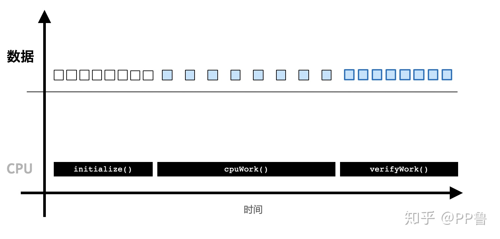
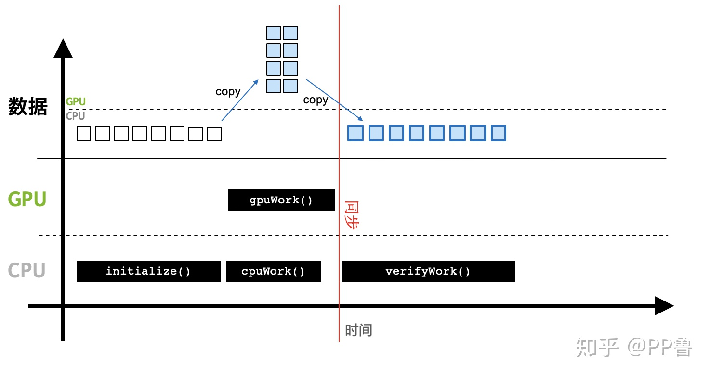
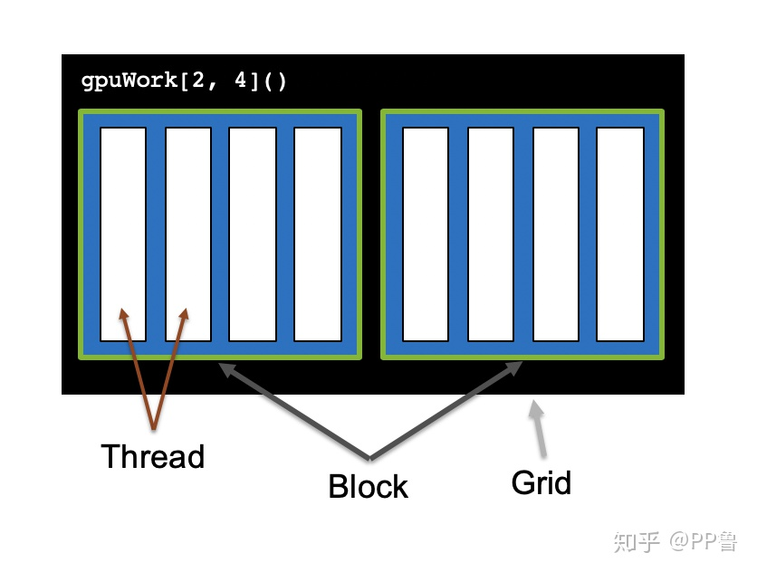
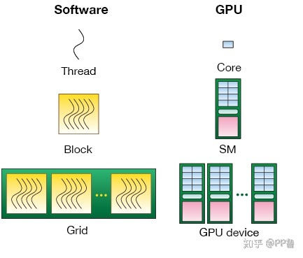
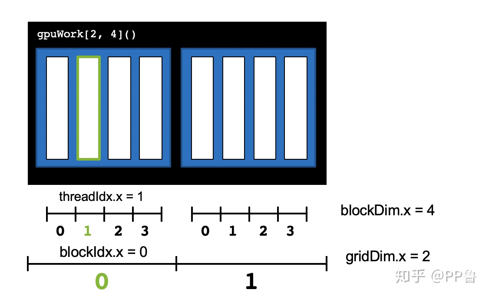
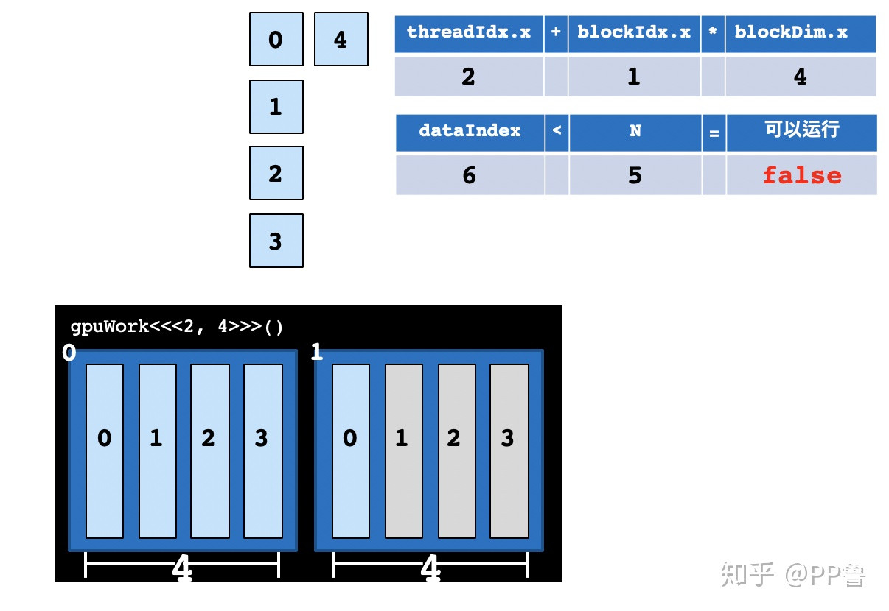
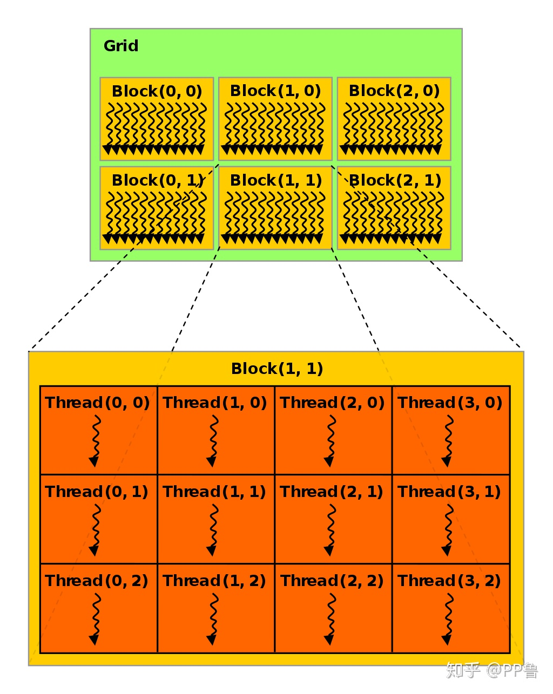
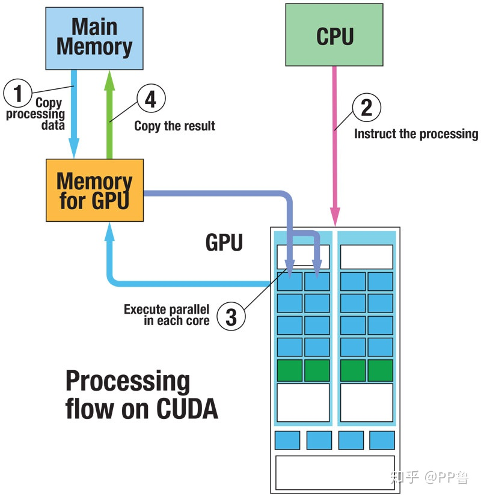

# Cuda programming 

## 2. 初识GPU编程

Python是当前最流行的编程语言，被广泛应用在深度学习、金融建模、科学和工程计算上。作为一门解释型语言，它运行速度慢也常常被用户诟病。著名Python发行商Anaconda公司开发的Numba库为程序员提供了Python版CPU和GPU编程工具，速度比原生Python快数十倍甚至更多。使用Numba进行GPU编程，你可以享受：

1. Python简单易用的语法；
2. 极快的开发速度；
3. 成倍的硬件加速。

### 2.1 GPU环境配置
在进行GPU编程前，需要先确认是否安装了CUDA工具箱，可以使用echo $CUDA_HOME检查CUDA环境变量，
返回值不为空说明已经安装好CUDA。也可以直接用Anaconda里的conda命令安装CUDA：


```
$ conda install cudatoolkit

安装Numba库：
$ conda install numba

检查一下CUDA和Numba是否安装成功：
from numba import cuda
print(cuda.gpus)
```
如果上述步骤没有问题，可以得到结果：<Managed Device 0>...。如果机器上没有GPU或没安装好上述包，会有报错.NOTE.md

### 2.2 GPU程序与CPU程序的区别



CPU程序是顺序执行的，一般需要：
1. 初始化。
2. CPU计算。
3. 得到计算结果。

在CUDA编程中，CPU和主存被称为主机（Host），GPU被称为设备（Device）。


当引入GPU后，计算流程变为：

1. 初始化，并将必要的数据拷贝到GPU设备的显存上。
2. CPU调用GPU函数，启动GPU多个核心同时进行计算。
3. CPU与GPU异步计算。
4. 将GPU计算结果拷贝回主机端，得到计算结果。

- 代码示例
```buildoutcfg
from numba import cuda

def cpu_print():
    print("print by cpu.")

@cuda.jit
def gpu_print():
    # GPU核函数
    print("print by gpu.")

def main():
    gpu_print[1, 2]()
    cuda.synchronize()
    cpu_print()

if __name__ == "__main__":
    main()
```


与传统的Python CPU代码不同的是：

1. 使用from numba import cuda引入cuda库
2. 在GPU函数上添加@cuda.jit装饰符，表示该函数是一个在GPU设备上运行的函数，GPU函数又被称为核函数。
4. 主函数调用GPU核函数时，需要添加如[1, 2]这样的执行配置，这个配置是在告知GPU以多大的并行粒度同时进行计算。gpu_print[1, 2]()表示同时开启2个线程并行地执行gpu_print函数，函数将被并行地执行2次。下文会深入探讨如何设置执行配置。
5. GPU核函数的启动方式是异步的：启动GPU函数后，CPU不会等待GPU函数执行完毕才执行下一行代码。必要时，需要调用cuda.synchronize()，告知CPU等待GPU执行完核函数后，再进行CPU端后续计算。这个过程被称为同步，也就是GPU执行流程图中的红线部分。如果不调用cuda.synchronize()函数，执行结果也将改变，"print by cpu.将先被打印。虽然GPU函数在前，但是程序并没有等待GPU函数执行完，而是继续执行后面的cpu_print函数，由于CPU调用GPU有一定的延迟，反而后面的cpu_print先被执行，因此cpu_print的结果先被打印了出来。


### 2.3 Thread层次结构

前面的程序中，核函数被GPU并行地执行了2次。
在进行GPU并行编程时需要定义执行配置来告知以怎样的方式去并行计算，比如上面打印的例子中，是并行地执行2次，还是8次，还是并行地执行20万次，或者2000万次。
2000万的数字太大，远远多于GPU的核心数，如何将2000万次计算合理分配到所有GPU核心上。解决这些问题就需要弄明白CUDA的Thread层次结构。


CUDA将核函数所定义的运算称为线程（Thread），多个线程组成一个块（Block），多个块组成网格（Grid）。
这样一个grid可以定义成千上万个线程，也就解决了并行执行上万次操作的问题。
例如，把前面的程序改为并行执行8次：可以用2个block，每个block中有4个thread。
```
原来的代码可以改为gpu_print[2, 4]()，其中方括号中第一个数字表示整个grid有多少个block，方括号中第二个数字表示一个block有多少个thread。
```

实际上，线程（thread）是一个编程上的软件概念。
从硬件来看，
1. thread运行在一个CUDA核心上，
2. 多个thread组成的block运行在Streaming Multiprocessor（SM的概念详见本系列第一篇文章)
3. 多个block组成的grid运行在一个GPU显卡上。



CUDA提供了一系列内置变量，以记录thread和block的大小及索引下标。
以[2, 4]这样的配置为例：blockDim.x变量表示block的大小是4，即每个block有4个thread，threadIdx.x变量是一个从0到blockDim.x - 1（4-1=3）的索引下标，记录这是第几个thread；
gridDim.x变量表示grid的大小是2，即每个grid有2个block，blockIdx.x变量是一个从0到gridDim.x - 1（2-1=1）的索引下标，记录这是第几个block。




```buildoutcfg
某个thread在整个grid中的位置编号为：threadIdx.x + blockIdx.x * blockDim.x
```
threadIdx.x: 一个从0到blockDim.x - 1（4-1=3）的索引下标，记录这是第几个thread；
blockIdx.x: 一个从0到gridDim.x - 1（2-1=1）的索引下标，记录这是第几个block
blockDim.x: 表示block的大小是4，即每个block有4个thread

```buildoutcfg
from numba import cuda

def cpu_print(N):
    for i in range(0, N):
        print(i)

@cuda.jit
def gpu_print(N):
    idx = cuda.threadIdx.x + cuda.blockIdx.x * cuda.blockDim.x 
    if (idx < N):
        print(idx)

def main():
    print("gpu print:")
    gpu_print[2, 4](8)
    cuda.synchronize()
    print("cpu print:")
    cpu_print(8)

if __name__ == "__main__":
    main()
```

这里的GPU函数在每个CUDA thread中打印了当前thread的编号(8线程同时进行互不干扰！！！)， 起到了CPU函数for循环同样的作用。
因为for循环中的计算内容互相不依赖，也就是说，某次循环只是专心做自己的事情，循环第i次不影响循环第j次的计算，所以这样互相不依赖的for循环非常适合放到CUDA thread里做并行计算。
在实际使用中，我们一般将CPU代码中互相不依赖的的for循环适当替换成CUDA代码。


这份代码打印了8个数字，核函数有一个参数N，N = 8，假如我们只想打印5个数字呢？
当前的执行配置共2 * 4 = 8个线程，线程数8与要执行的次数5不匹配，不过我们已经在代码里写好了if (idx < N)的判断语句，判断会帮我们过滤不需要的计算。
```buildoutcfg
我们只需要把N = 5传递给gpu_print函数中就好，CUDA仍然会启动8个thread，但是大于等于N的thread不进行计算。
```
注意，当线程数与计算次数不一致时，一定要使用这样的判断语句，以保证某个线程的计算不会影响其他线程的数据。



### 2.4 Block大小设置

不同的执行配置会影响GPU程序的速度，一般需要多次调试才能找到较好的执行配置，在实际编程中，执行配置[gridDim, blockDim]应参考下面的方法：

1. block运行在SM上，不同硬件架构（Turing、Volta、Pascal...）的CUDA核心数(threads)不同，一般需要根据当前硬件来设置block的大小blockDim（执行配置中第二个参数）。
一个block中的[thread数最好是32、128、256的倍数]()。
注意，限于当前硬件的设计，block大小不能超过1024。
2. grid的大小gridDim（执行配置中第一个参数），即一个grid中block的个数可以由总次数N除以blockDim，并向上取整。
```buildoutcfg
例如，我们想并行启动1000个thread，可以将blockDim设置为128，1000 ÷ 128 = 7.8，向上取整为8。
使用时，执行配置可以写成gpuWork[8, 128]()，CUDA共启动8 * 128 = 1024个thread，实际计算时只使用前1000个thread，多余的24个thread不进行计算。

```

注意，这几个变量比较容易混淆，再次明确一下：
1. [blockDim]()是block中thread的个数
2. 一个block中的threadIdx最大不超过blockDim
3. [gridDim]()是grid中block的个数
4. 一个grid中的blockIdx最大不超过gridDim。

```buildoutcfg
gpuwork[gridDim, blockDim]()
```


以上讨论中，block和grid大小均是一维，实际编程使用的执行配置常常更复杂，block和grid的大小可以设置为二维甚至三维，
如下图所示。这部分内容将在下篇文章中讨论。


### 2.5 内存分配
前文提到，GPU计算时直接从显存中读取数据，因此每当计算时要将数据从主存拷贝到显存上，用CUDA的术语来说就是要[把数据从主机端拷贝到设备端]()。
CUDA强大之处在于它能[自动将数据从主机和设备间相互拷贝]()，不需要程序员在代码中写明。这种方法对编程者来说非常方便，不必对原有的CPU代码做大量改动。

我们以一个向量加法为例，编写一个向量加法的核函数如下：

```buildoutcfg
@cuda.jit
def gpu_add(a, b, result, n):
    # a, b为输入向量，result为输出向量
    # 所有向量都是n维
    # 得到当前thread的索引
    idx = cuda.threadIdx.x + cuda.blockDim.x * cuda.blockIdx.x
    if idx < n:
        result[idx] = a[idx] + b[idx]
```

```buildoutcfg
    gpu vector add time 0.6893036365509033
    cpu vector add time 0.026129722595214844
```

这里GPU比CPU慢很多原因主要在于：

1. 向量加法的这个计算比较简单，CPU的numpy已经优化到了极致，无法突出GPU的优势，我们要解决实际问题往往比这个复杂得多，当解决复杂问题时，优化后的GPU代码将远快于CPU代码。
2. 这份代码使用CUDA默认的[统一内存管理机制]()，没有对数据的拷贝做优化。
CUDA的统一内存系统是[当GPU运行到某块数据发现不在设备端时，再去主机端中将数据拷贝过来，当执行完核函数后，又将所有的内存拷贝回主存]()。
在上面的代码中，输入的两个向量是只读的，没必要再拷贝回主存。
3. 这份代码没有做[流水线优化]()。
    CUDA并非同时计算2千万个数据，一般分批流水线工作：[一边对2000万中的某批数据进行计算]()，[一边将下一批数据从主存拷贝过来]()。
    计算占用的是CUDA核心，数据拷贝占用的是总线，所需资源不同，互相不存在竞争关系。
    这种机制被称为流水线。这部分内容将在下篇文章中讨论。
    

原因2中本该程序员动脑思考的问题交给了CUDA解决，增加了时间开销，所以CUDA非常方便的统一内存模型缺点是计算速度慢。
针对原因2，我们可以继续优化这个程序，告知GPU哪些数据需要拷贝到设备，哪些需要拷贝回主机。

```buildoutcfg
gpu（non-optmi） vector add time 0.4571092128753662
gpu vector add time 0.001990079879760742
gpu vector add time 0.0009980201721191406
gpu vector add time 0.0009696483612060547
cpu vector add time 0.02692866325378418
```

至此，可以看到GPU速度终于比CPU快了很多。
1. gpu 需要一些启动时间，所以第一个函数会比较费时
2. 优化后的核函数，将数据拷贝至显存，并将输出留在显存，得以提速
3. gpu 的特性是一旦启动越算越快，cpu 相反

Numba对Numpy的比较友好，编程中一定要使用Numpy的数据类型。用到的比较多的内存分配函数有：

gpu 显存和cpu 存储之间的交换
cuda.device_array()： 在设备上分配一个空向量，类似于numpy.empty()
cuda.to_device()：将主机的数据拷贝到设备
ary = np.arange(10)
device_ary = cuda.to_device(ary)
cuda.copy_to_host()：将设备的数据拷贝回主机
host_ary = device_ary.copy_to_host()

### 2.6 结论

- Python Numba库可以调用CUDA进行GPU编程
- CPU端被称为主机
- GPU端被称为设备，运行在GPU上的函数被称为核函数，调用核函数时需要有执行配置，以告知CUDA以多大的并行粒度来计算
- 使用GPU编程时要合理地将数据在主机和设备间互相拷贝

